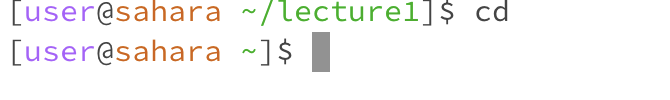
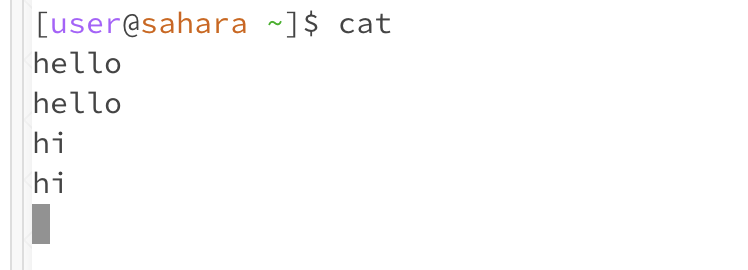
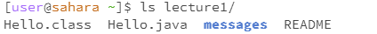
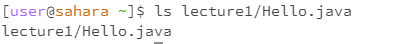

# CSE 15L Lab Report 1
## Yuchen Guo
***
- **cd** w/ no argument: The current working directory is /home/lecture1. The terminal does not give any output but the directory changes to the /home directory. This not an error
- 
- **ls** w/ no argument: The current working directory is /home. The return output lists all directories and files under the current working directory because we did not put any arguments to give specific path. The output is not an error.
- 
- **cat** w/ no argument: The current working directory is /home. The return output is blank. But when I type anything to the terminal, it just return exactly what I typed, like echo. To end the task, we can use ctrl+C.  
- 
- **cd** w/ path to a directory: The current working directory is /home, after execute the command, it changes to /home/lecture1. So, since we only change the working directory, there are no other outputs. And outputs have no errors.
- 
- **ls** w/ path to a directory: The current working directory is /home. The return output lists all directories and files under the directory called lecture1  The output is not an error.
- 
- **cat** w/ path to a directory: The current working directory is /home. The return output shows an error message because cat command is used for showing the content of the file instead of the directory. 
- 
- **cd** w/ path to a file: The current working directory is /home. The return output shows an error message because cd command is used for changing directory; however, we put a path to a file after it. So, the output shows the error.
- 
- **ls** w/ path to a file: The current working directory is /home. The return output shows the path to file Hello.java since it is the only file in the path that was given. The output is not an error.
- 
- **cat** w/ path to a file: The current working directory is /home. The return output shows the content of the Hello.java file. The output is not an error.
- 

