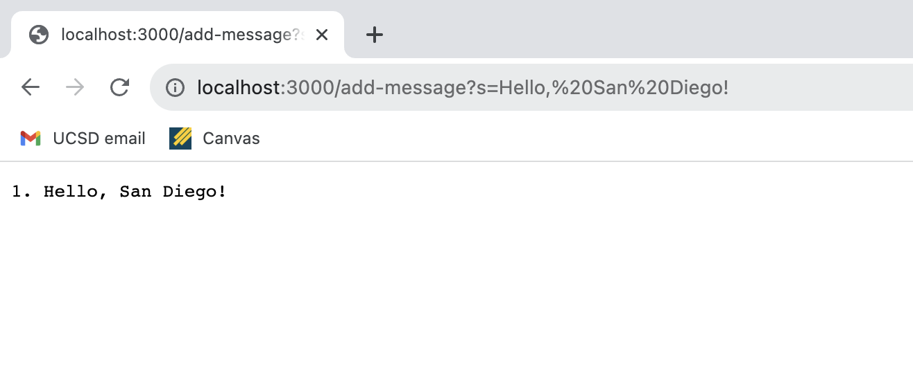
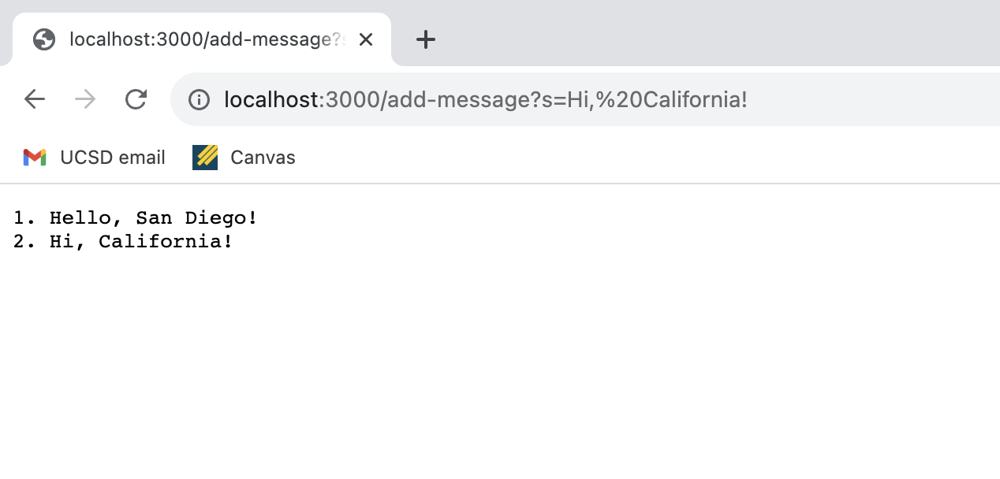
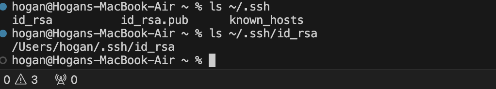
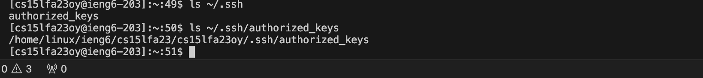

# CSE 15L Lab Report 1
## Yuchen Guo
### Part1

StringServer
```
import java.io.IOException;
import java.net.URI;
import java.util.ArrayList;

class Handler implements URLHandler {
    // The one bit of state on the server: a number that will be manipulated by
    // various requests.
    String message = ""; 
    int num = 0;

    public String handleRequest(URI url) {

        if (url.getPath().equals("/add-message")) {

            String[] parameters = url.getQuery().split("=");
                if (parameters[0].equals("s")) {
                    num++;
                    message = message + String.format(num +". "+parameters[1]+"\n");
                    return message;
                }
            }
            return message;
        }
}

class StringServer {
    public static void main(String[] args) throws IOException {
        if(args.length == 0){
            System.out.println("Missing port number! Try any number between 1024 to 49151");
            return;
        }
        int port = Integer.parseInt(args[0]);

        Server.start(port, new Handler());
    }
}
```


- The handleRequest method in the Handler class was called. It takes the URI as an argument and the values are num(int), message(String).
The num value gets increment to 1  and the message, which was empty, concatenates the string "1. Hello, San Diego!" after the request.


- The handleRequest method in the Handler class was called. It takes the URI as an argument and the values are num(int), message(String).
The num value gets increment to 2  and the message concatenates the string "2. Hello, California!" after the request.


### Part2

-
-
-

### Part3
-I learned a lot about command line, like how to look up files or directories by using the terminal, and use ssh to log onto a remote server.
Also, I learn query in url which is pretty cool that I could enter text in a url on the browser and get outputs.


