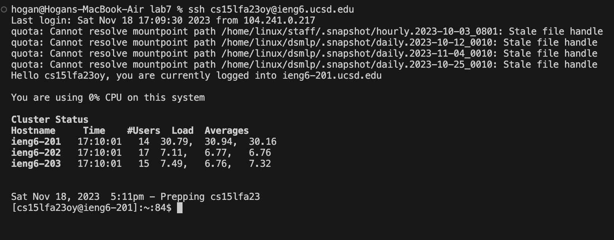

# CSE 15L Lab Report 3
## Yuchen Guo

**Step4: Log into ieng6**
key pressed: *ssh<space>cs15lfa23@ieng.ucsd.edu<Enter>*\

**Step5: Clone your fork of the repository from your Github account**
key pressed: *git<space>clone<space><command>+v<Enter>*(copy paste ssh key from github)\

**Step6: Run the tests, demonstrating that they fail**
key pressed: *cd<space>lab7<Enter>*(change working directory to lab7)\
             *bash<space>test.sh<Enter>*(run tests)\

**Step7: Edit the code file ListExamples.java to fix the failing test**
key pressed:*vim<space>List<Tab>.java*(open vim and use tab for quickly entering file name)\

key pressed:*/index1<Enter>nnnnnnnnnlllllr2:wq*(search index1 and press 'n' 9 times to navigate to the line that causes error and press 'l' to move cursor on 1 and press 'r' and '2' to replace the index1 to index 2; and use ':wq' to save and quit)\

**Step8: Run the tests, demonstrating that they now succeed**
key pressed:*<up><up><Enter>*(the bash test.sh command was two up in the terminal so I use arrow key to access it)\

**Step9: Commit and push the resulting change to your Github account**
key pressed:*git<space>add<space>Lis<Tab><Enter>*(use tab for quick complete)\
            *git<space>commit<space>-m<space>fixed<Enter>*(commit with the message "fixed")\
            *git<space>push<space>origin<space>maste<Enter>*(push changes to Github)\
            
