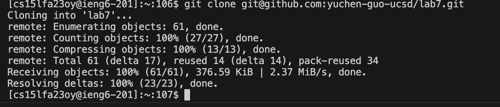
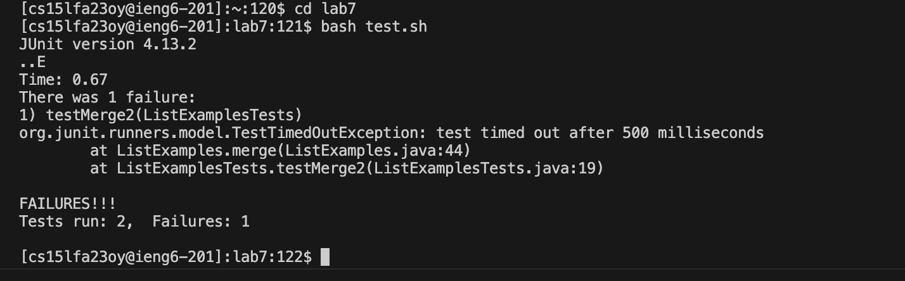

# CSE 15L Lab Report 4
## Yuchen Guo

**Step4: Log into ieng6**\
key pressed: *ssh&lt;space&gt;cs15lfa23@ieng.ucsd.edu&lt;Enter&gt;*\

**Step5: Clone your fork of the repository from your Github account**\
key pressed: *git&lt;space&gt;clone&lt;space&gt;&lt;command&gt;+v&lt;Enter&gt;*(copy paste ssh key from github)\

**Step6: Run the tests, demonstrating that they fail**\
key pressed: *cd&lt;space&gt;lab7&lt;Enter&gt;*(change working directory to lab7)\
             *bash&lt;space&gt;test.sh&lt;Enter&gt;*(run tests)\

**Step7: Edit the code file ListExamples.java to fix the failing test**\
key pressed:*vim&lt;space&gt;List&lt;Tab&gt;.java*(open vim and use tab for quickly entering file name)\

key pressed:*/index1&lt;Enter&gt;nnnnnnnnnlllllr2:wq*(search index1 and press 'n' 9 times to navigate to the line that causes error and press 'l' to move cursor on 1 and press 'r' and '2' to replace the index1 to index 2; and use ':wq' to save and quit)\

**Step8: Run the tests, demonstrating that they now succeed**\
key pressed:*&lt;up&gt;&lt;up&gt;&lt;Enter&gt;*(the bash test.sh command was two up in the terminal so I use arrow key to access it)\

**Step9: Commit and push the resulting change to your Github account**\
key pressed:*git&lt;space&gt;add&lt;space&gt;Lis&lt;Tab&gt;&lt;Enter&gt;*(use tab for quick complete)\
            *git&lt;space&gt;commit&lt;space&gt;-m&lt;space&gt;fixed&lt;Enter&gt;*(commit with the message "fixed")\
            *git&lt;space&gt;push&lt;space&gt;origin&lt;space&gt;maste&lt;Enter&gt;*(push changes to Github)\
            
