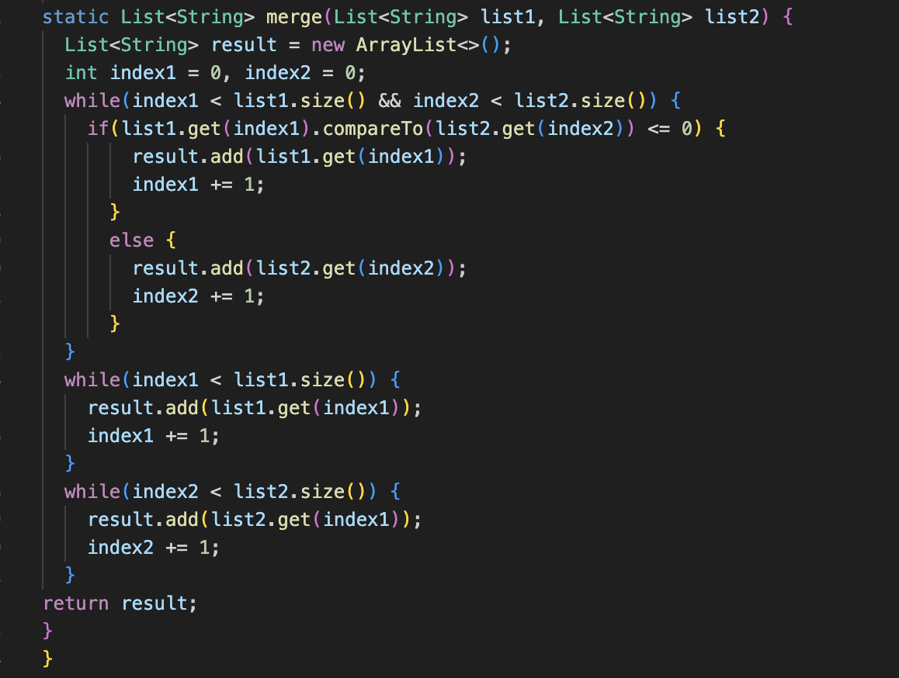
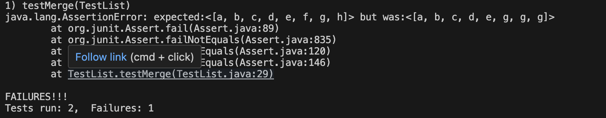
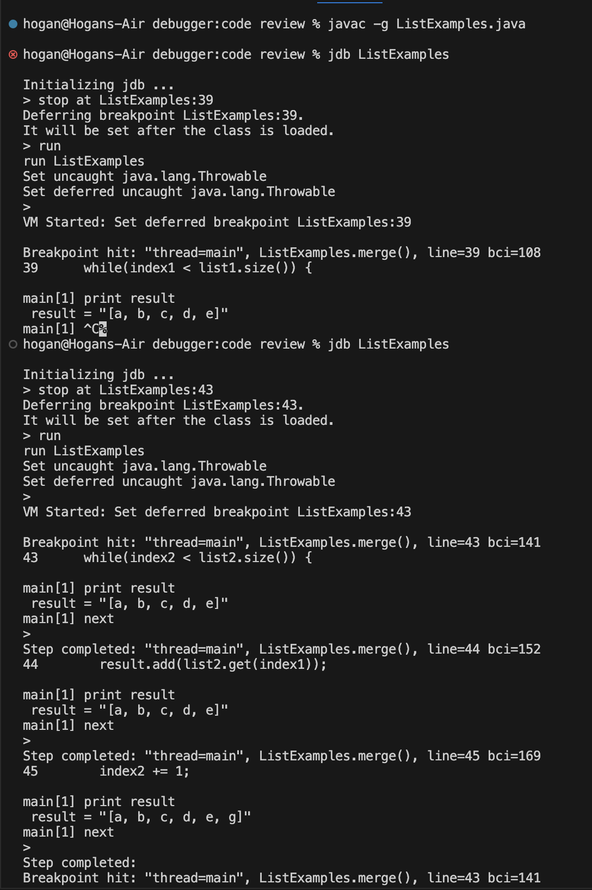
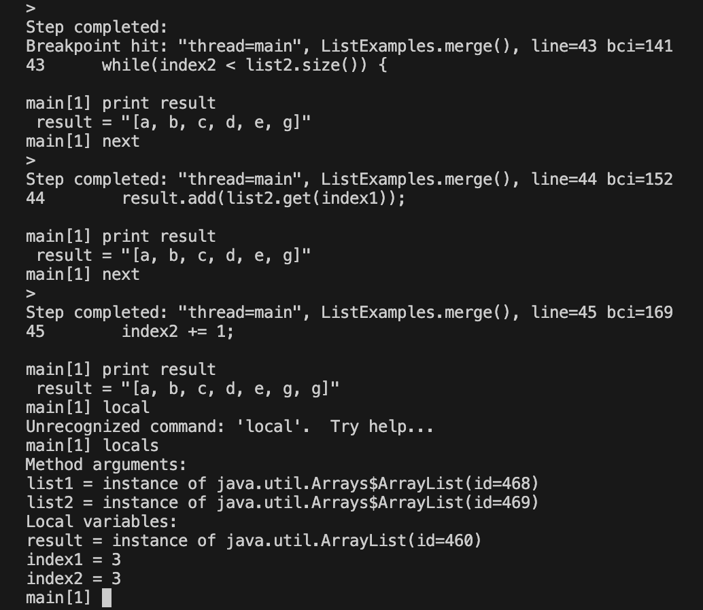
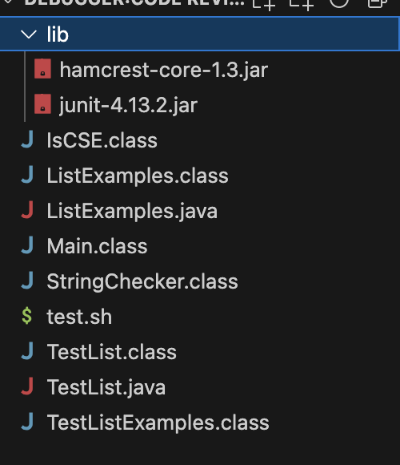
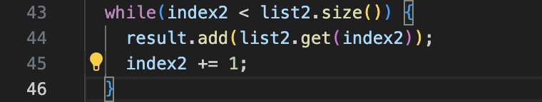

# CSE 15L Lab Report 5
## Yuchen Guo

### Part1
**Student:**\
Hi, tutors. I've having trouble with the merge method in the ListExamples. I did a junit test, and it seems like something wrong with the process when the second list is merging with the first one, like it have many duplicates of letter g and skip other letters in the list. 




**Tutor:**\
Did you check all your indexings? Remember you could use 'jdb' to help you identify and make sure certain value is correct.  (checkout Week8 module/lectures for more detail information). The commands 'step' and 'next' in jdb could be helpful for you to debug line by line.

**Student**\
I tried to use jdb and found that the whileloop starts at line 43 in ListExamples.java cause the weird behavior. I accidently put index1 instead of index2 at line 44 so the result is adding the element in list2 based on index1 so it keeps adding 'g' at the end in the final output. 



**About the Setup**\
The file Structure:

\

Contents:\
ListExampels.java
```
import java.util.ArrayList;
import java.util.List;
import java.util.Arrays;

interface StringChecker { boolean checkString(String s); }

class ListExamples {

  public static void main(String[]arg){
    List<String> output = new ArrayList<String>();
    output = merge(Arrays.asList("a", "c", "e"), Arrays.asList("b", "d", "f", "g", "h"));
    System.out.println(output);
  }

  static List<String> filter(List<String> list, StringChecker sc) {
    List<String> result = new ArrayList<>();
    for(String s: list) {
      if(sc.checkString(s)) {
        result.add(s);
      }
    }
    return result;
  }


static List<String> merge(List<String> list1, List<String> list2) {
  List<String> result = new ArrayList<>();
  int index1 = 0, index2 = 0;
  while(index1 < list1.size() && index2 < list2.size()) {
    if(list1.get(index1).compareTo(list2.get(index2)) <= 0) {
        result.add(list1.get(index1));
        index1 += 1;
      }
      else {
        result.add(list2.get(index2));
        index2 += 1;
      }
  }
  while(index1 < list1.size()) {
    result.add(list1.get(index1));
    index1 += 1;
  }
  while(index2 < list2.size()) {
    result.add(list2.get(index1));
    index2 += 1;
  }
return result;
}
 
}
```
TestList.java
```
import static org.junit.Assert.*;
import org.junit.*;
import java.util.Arrays;
import java.util.List;

class IsCSE implements StringChecker {
  public boolean checkString(String s) {
    return s.equalsIgnoreCase("CSE");
  }
}

public class TestList {

  @Test(timeout = 500)
  public void testFilter() {
    List<String> input = Arrays.asList("CSE", "a", "15", "L", "CSE15L");
    List<String> expected = Arrays.asList("CSE");
    List<String> filter = ListExamples.filter(input, new IsCSE());
    assertArrayEquals(filter.toArray(), expected.toArray());
  }

  @Test
  (timeout = 500)
  public void testMerge() {
    List<String> left = Arrays.asList("a", "c", "e");
    List<String> right = Arrays.asList("b", "d", "f", "g", "h");
    List<String> merged = ListExamples.merge(left, right);
    List<String> expected = Arrays.asList("a", "b", "c", "d", "e", "f", "g", "h");
    assertEquals(expected, merged);
  }
}

```
test.sh
```
javac -cp .:lib/hamcrest-core-1.3.jar:lib/junit-4.13.2.jar *.java
java -cp .:lib/hamcrest-core-1.3.jar:lib/junit-4.13.2.jar org.junit.runner.JUnitCore TestList
```

Fixed bug:\


Change index1 to index2 in 'result.add(list2.get(index2))' so it fixed the bug;


### Part2
**Reflection**\
I learned how to debugging use junit and jdb, which are super helpful for find those bugs and error in my programming projects. The activity that we were creating the GradeServer is pretty cool experience to be like a grader and kind of know the process that how the AutoGrader works on GradeScope. 
